# 快速开始

下面通过一个简单的例子，来让您快速上手GTS Engine的使用。

## 启动Docker

```
#启动docker
docker run -it --name  gst_engine \
-p 5201:5201 \
--mount type=bind,source=/raid/liuyibo/GTS-Engine/files,target=/workspace/gts_teacher_service/files \
gts_engine_image:v0  

#运行api.py
CUDA_VISIBLE_DEVICES=0 python api.py
```
--mount 加载主机的 /raid/liuyibo/GTS-Engine/files 目录到容器的 /workspace/gts_teacher_service/files目录，其中本地目录的路径必须是绝对路径
-p  本地端口与docker端口映射

## 进入api调试界面
运行 python api.py  运行终端界面会出现 ``http://0.0.0.0:5201`` 点击网页，将跳转网页网址栏出现的 ``http://localhost:5201/``修改为 ``http://192.168.190.63:5201/docs#`` 
其中``192.168.190.63``必须修改为你运行时的ip地址

## 准备训练数据

- 点击Try it out, 选择数据上传文件
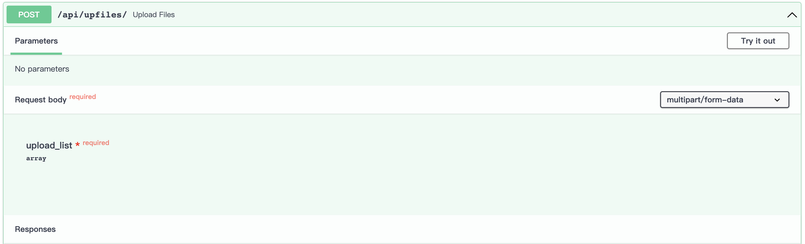

- 点击Execute即上传数据
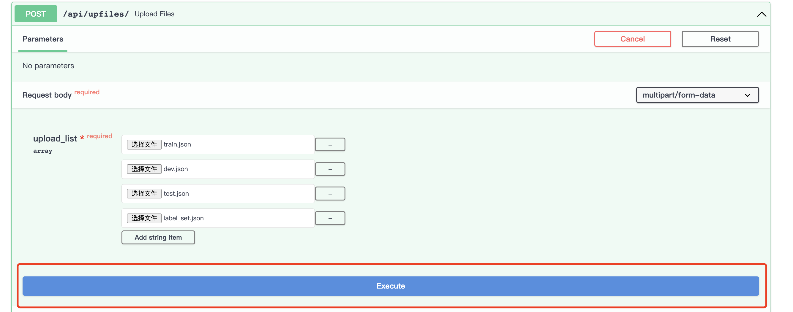

- 上传成功
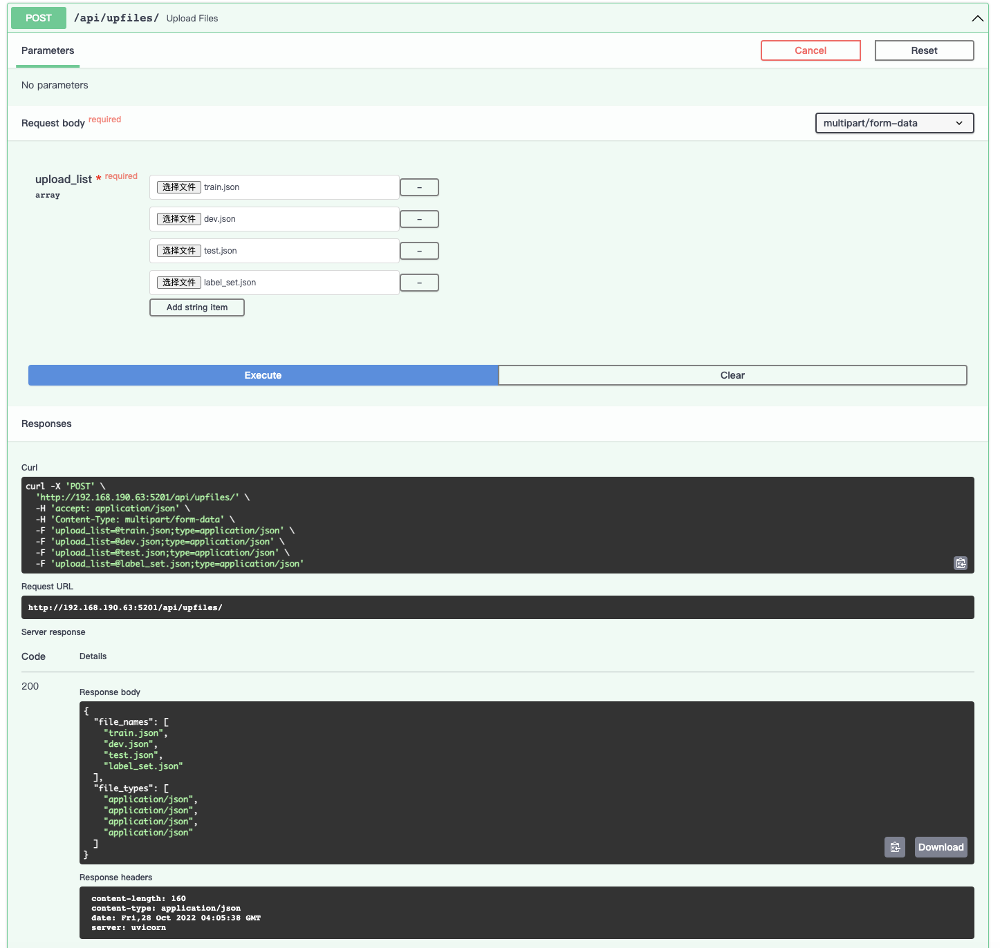


## 启动训练

- 点击Try it out
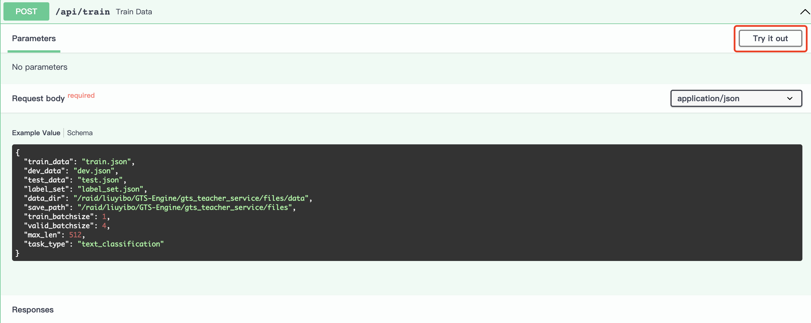

- 参数可以进行修改, 点击Execute即开始训练
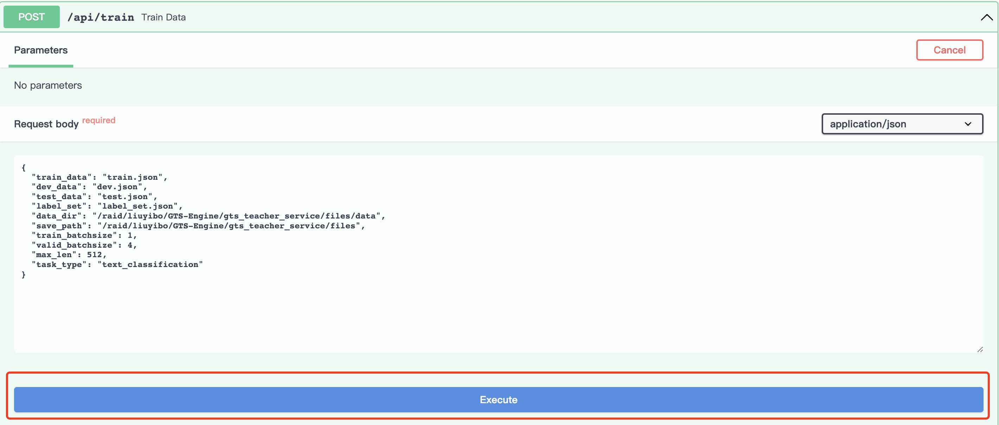

- 训练任务后台运行返回训练任务id
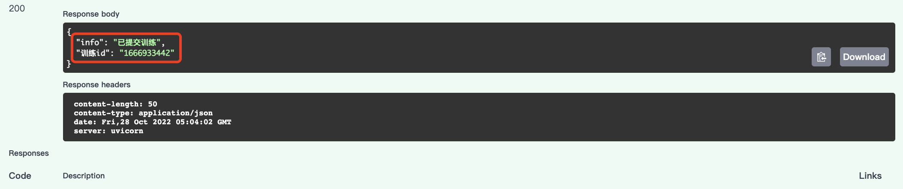


## 任务状态

- 点击Try it out
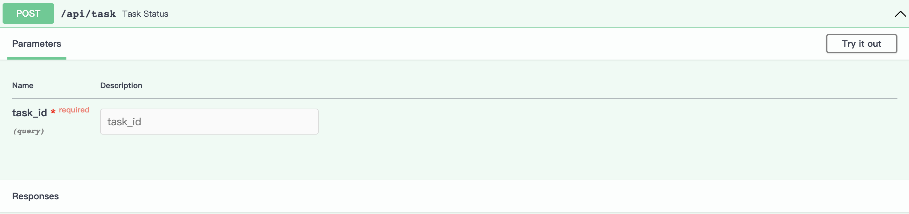

- task_id处填写训练任务返回的任务id, 点击Execute可查看训练任务状态
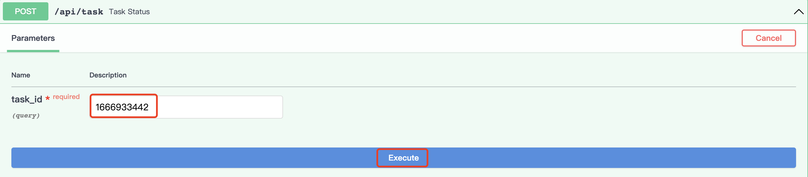

- 训练状态返回
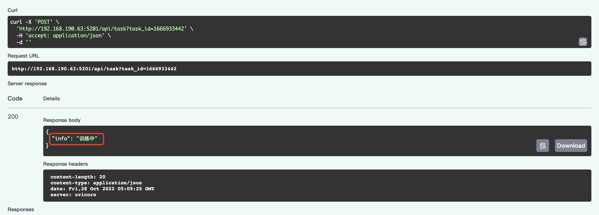


## 启动推理

- 点击Try it out


- 参数可以进行修改, 其中checkpoint_path可以选择训练任务的ckpt文件, 点击Execute即开始预测
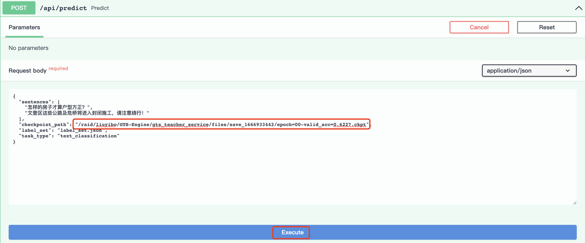

- 预测结果返回
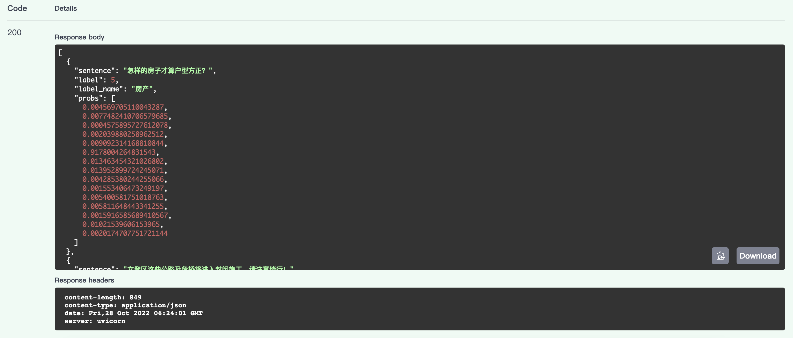