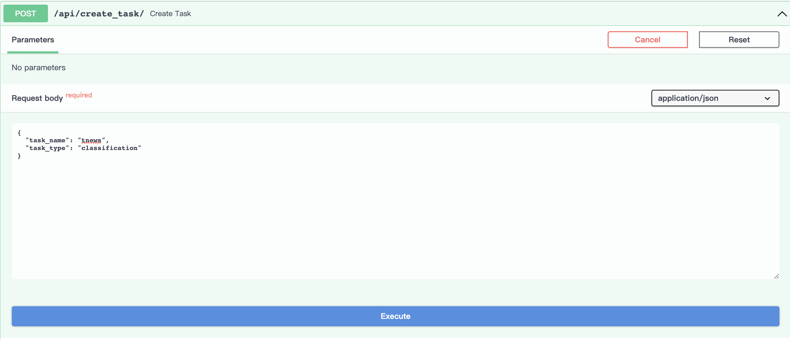

# 快速开始
## 服务启动

下面通过一个简单的例子，来让您快速上手GTS Engine的使用。
首先提供以下三种启动服务的方法：
- [pip启动](#pip启动)
- [源码启动](#源码启动)
- [Docker启动](#Docker启动)


### pip启动
```bash
#为了避免与原来环境下载包的版本不同导致冲突，可以新建环境
conda create -n gts_project python=3.8
#环境激活
conda activate gts_project
#下载gts-engine包
pip install gts-engine 
```
选择适合适配显卡的cuda版本torch安装，torch版本要求1.11.0，[下载地址](https://download.pytorch.org/whl/torch_stable.html)

示例：NVIDIA版本```Driver Version: 450.80.02, CUDA Version: 11.0 ```
[可直接下载](https://download.pytorch.org/whl/cu113/torch-1.11.0%2Bcu113-cp38-cp38-linux_x86_64.whl)
```bash
#下载成功cuda版本torch，安装
pip install torch-1.11.0+cu113-cp38-cp38-linux_x86_64.whl
```
需要新建名为```pretrained```，```tasks``` 的两个文件夹  
建议按需下载模型（请见下表）。如果不下载，训练时会自动从```huggingface```下载，由于模型文件较大，可能因为网络原因导致下载失败，从而导致模型训练失败
| engine_type | task_type      | Mode     | 建议下载模型                                                 |
| ----------- | -------------- | -------- | ------------------------------------------------------------ |
| qiankunding | classification、similarity、nli          | standard | [Erlangshen-UniMC-MegatronBERT-1.3B-Chinese](https://huggingface.co/IDEA-CCNL/Erlangshen-UniMC-MegatronBERT-1.3B-Chinese) |
| qiankunding | classification、similarity、nli          | advanced | [Erlangshen-TCBert-1.3B-Classification-Chinese](https://huggingface.co/IDEA-CCNL/Erlangshen-TCBert-1.3B-Classification-Chinese) |
| bagualu     | classification | standard | [Erlangshen-MacBERT-110M-BinaryClasssification-Chinese](https://huggingface.co/IDEA-CCNL/Erlangshen-MacBERT-110M-BinaryClasssification-Chinese)(二分类任务)、[ernie-1.0-base-zh](https://huggingface.co/PaddlePaddle/ernie-1.0-base-zh)(多分类任务) [chinese-macbert-base](https://huggingface.co/hfl/chinese-macbert-base) (多分类任务)     |
| Bagualu     | ie             | standard |                                                              |
```bash
#将下载好的模型文件放在pretrained（如：Erlangshen-UniMC-MegatronBERT-1.3B-Chinese）
mkdir pretrained  
mkdir tasks
```
```bash
#为避免文件地址不存在，--task_dir对应的参数写新建的tasks文件夹的绝对路径
#为避免文件地址不存在，--pretrained_dir对应的参数写新建的pretrained_dir文件夹的绝对路径
#--port表示服务启动的端口号
CUDA_VISIBLE_DEVICES=0 gts_engine_service --task_dir tasks \
--pretrained_dir pretrained --port 5201  #指定GPU 运行api.py
```

```
CUDA_VISIBLE_DEVICES=0 python gts_engine_service.py --task_dir tasks --pretrained_dir pretrained --port 5201 
```

### 源码启动
[GTS-Engine源码地址](https://github.com/IDEA-CCNL/GTS-Engine)

```bash
#下载源码
git clone https://github.com/IDEA-CCNL/GTS-Engine.git 
cd GTS-Engine
#下载包
python setup.py install
#cuda版本torch安装   具体参考上述pip启动的建议
pip install torch-1.11.0+cu113-cp38-cp38-linux_x86_64.whl
#将下载好的Erlangshen-UniMC-MegatronBERT-1.3B-Chinese模型文件放在pretrained  具体参考上述pip启动的建议
mkdir pretrained
mkdir tasks
cd gts_engine
#参数介绍参考上述pip启动的建议
CUDA_VISIBLE_DEVICES=0 python gts_engine_service.py --task_dir tasks --pretrained_dir pretrained --port 5201  
```

如下所示，代码目录gts_engine和预训练模型目录pretrained、任务目录tasks在同一级目录，在pretrained目录中存放预训练模型文件，在tasks中存放任务相关的数据和模型。

```
├─GTS-Engine
│   ├── gts_engine
    ├─pretrained
│       ├── Erlangshen-UniMC-MegatronBERT-1.3B-Chinese（乾坤鼎）
        ├──Erlangshen-MacBERT-110M-BinaryClasssification-Chinese（八卦炉）
        ├── ernie-1.0-base-zh （八卦炉）  
        ├── chinese-macbert-base（八卦炉）       
    ├─tasks
│       ├── tnews

```

您也可以通过命令行脚本进行训练和推理，具体示例请看`examples/text_classification`。

### Docker启动
[Docker入门](https://yeasy.gitbook.io/docker_practice)
```bash
#docker下载
sudo docker push gtsfactory/gts-engine:v0
#docker启动
#--mount 注：目录挂载source对应的必须是存在的本地绝对路径
#-p 本地端口与docker端口映射
sudo docker run -it --name gts_engine \
-p 5201:5201 \
--mount type=bind,source=/usr/tasks,target=/workspace/GTS-Engine/tasks \
gtsfactory/gts-engine:v0
#更新代码
cd GTS-Engine
git pull
cd gts_engine
#启动服务
CUDA_VISIBLE_DEVICES=0 python gts_engine_service.py --port 5201
```


## API接口使用

我们支持两种方式来使用我们的引擎：通过Python SDK的方式和Web页面的方式。通过Python SDK的方式请参考[GTS-Engine-Client](https://github.com/IDEA-CCNL/GTS-Engine-Client)。

下面通过fewCLUE中的tnews任务为例，介绍Web页面使用引擎的方式。

- 1.[api调试界面](#api调试界面)
- 2.[创建任务](#创建任务)
- 3.[查看任务列表](#查看任务列表)
- 4.[查看任务状态](#查看任务状态)
- 5.[删除任务](#查看任务状态)
- 6.[上传数据](#上传数据)
- 7.[启动训练](#启动训练)
- 8.[停止训练](#停止训练)
- 9.[开启推理模式](#开启推理模式)
- 10.[推理](#推理)
- 11.[结束推理](#结束推理)

#### api调试界面
GTS-Engine启动成功后的会显示如下界面：

```bash
INFO:     Started server process [3509632]
INFO:     Waiting for application startup.
INFO:     Application startup complete.
INFO:     Uvicorn running on http://0.0.0.0:5201 (Press CTRL+C to quit)
```

用浏览器访问：http://0.0.0.0:5201/docs，跳转到api交互式界面：


#### 创建任务
初始界面如下：


点击`Try it out`按钮，设置task_name和task_type对应的参数，参数要求为字符串类型。

本示例中，以启动乾坤鼎为例，task_name设为tnews, task_type设为classification，engine_type设为qiankunding

engine_type：只能设定为qiankunding、bagualu其中一种

task_type：只能指定为classification、similarity、nli其中一种，其中qiankunding目前只支持classification；bagualu支持ie、classification


注：task_name可以选填，为了方便后续任务管理，建议设置task_name参数，会生成与task_name同名的task_id，如果不设置task_name参数，会自动生成task_id，以下展示两种方式：

- 设置task_name参数。


- 点击`Execute`按钮执行，运行成功，会返回如下结果，其中task_id的值是tnews，为我们指定的task_name的参数。


- 不设置task_name参数


点击`Execute`按钮执行，运行成功，会返回如下结果，其中task_id的值是由task_type与当前时间生成。


#### 查看任务列表
点击`Try it out`按钮，此接口不需设置参数，点击`Execute`按钮执行，将返回已运行完成和正在运行的所有任务，本示例中，可以看到有两个刚刚创建的任务。


#### 查看任务状态
点击`Try it out`按钮，设置任务id参数为tnews。


点击`Execute`执行，因为还未执行tnews任务，可以看到tnews任务处于"Initialized"的初始状态。


#### 删除任务
点击`Try it out`, 设置任务id参数为为想要删除的任务id，本示例删除任务classification_20221104114148。

（注：会删除掉此任务下上传的数据以及训练好的模型的所有相关文件）


点击`Execute`执行，成功返回如下结果：


执行查看任务列表的接口，可以看到classification_20221104114148任务已不存在。


#### 上传数据
点击`Try it out`，从本地文件选择数据上传文件，我们上传了训练集、验证集、测试集、标签数据, 设置task_id为tnews。


点击Execute即上传数据：


#### 启动训练
点击`Try it out`，设置相应参数，其中gpuid参数是用来指定使用哪块gpu：


点击`Execute`，后台启动运行训练：


运行查看任务状态接口，可查看训练时的状态，下图显示模型正在训练中：


下图显示模型已训练成功：


#### 停止训练
点击`Try it out`，设置task_id参数为tnews：


点击`Execute`，tnews的训练任务会被终止。


#### 开启推理

模型训练成功，可以开启该任务的预测功能，预测样本要首先运行该接口。

点击`Try it out`，设置task_id参数为tnews，点击`Execute`，开始加载预测模型：


模型加载成功：


运行查看任务状态接口，下图显示任务已开启预测模式：


#### 推理

点击`Try it out`，设置对应参数，sentences对应的是列表，列表中每个元素是字符串形式的待预测样本：


点击`Execute`，会返还如下预测结果：


#### 结束推理
点击`Try it out`，设置task_id参数：


点击`Execute`：


运行查看任务状态接口，下图显示任务结束推理， 返回训练完成后的状态：


